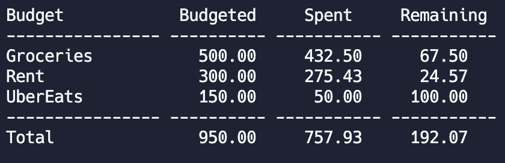

<h1 align="center">Wallet Wizard: Budgeting Mastery</h1>

An intuitive Python-based financial management (budgeting) tool. It allows you to seamlessly manage budgets, allocate funds to specific categories, and track expenses, all while enjoying a comprehensive financial overview.

<h4>How It's Made:</h4>

Tech Used: Python

## 🚨 Forking this repo

This code cannot be used for college assignments. I value keeping this code on github as part of my portfolio, but as you all know, <b>plagiarism is bad</b>. I spent a non-negligible amount of effort developing and designing this project and I am proud of it! All I ask is to not claim this effort as your own.

